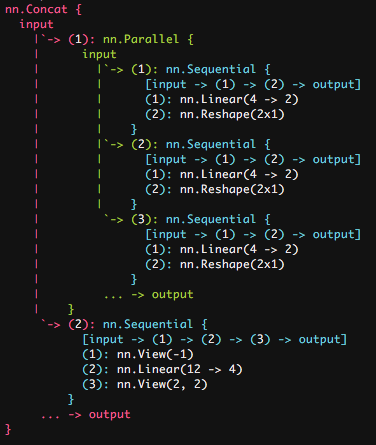

# Pretty-nn

`pretty-nn` package brings some colour to the boring `nn` package of Torch.

Say we have the following model

```lua
c = nn.Parallel(1,2)
for i = 1, 3 do
   local t = nn.Sequential()
   t:add(nn.Linear(4, 2))
   t:add(nn.Reshape(2, 1))
   c:add(t)
end
split = nn.Concat(2)
split:add(c)
block = nn.Sequential()
block:add(nn.View(-1))
block:add(nn.Linear(12, 4))
block:add(nn.View(2, 2))
split:add(block)

print(split)
nn.config.prettyPrint = false
print(split)
pred = split:forward(torch.randn(3, 4))
```

If we print it on screen with `print(split)` we get something like this


If we `require 'pretty-nn'` and `print(split)` again, we'll get this



You can toggle the prettiness with `yourModelName:prettyPrint()`.
Alternative, you can *enable / disable* it by `yourModelName:prettyPrint(true / false)`.
